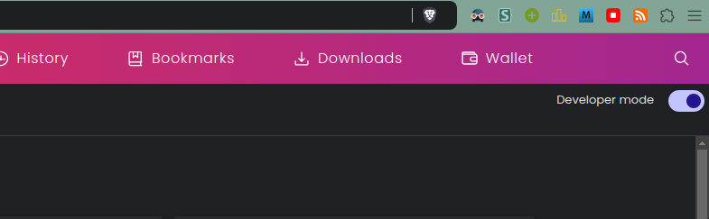
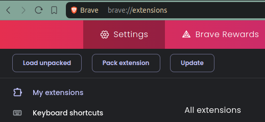
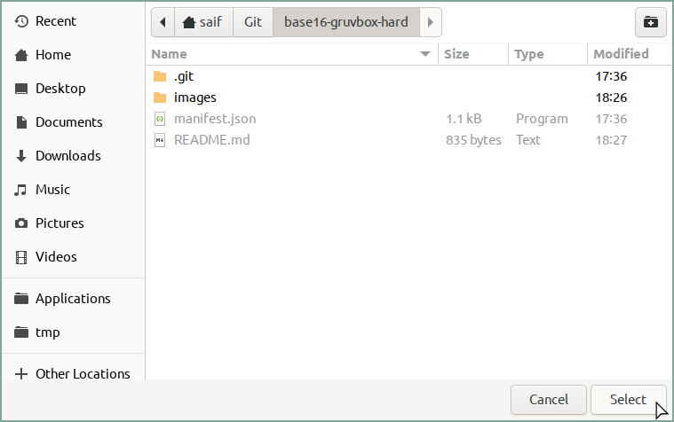
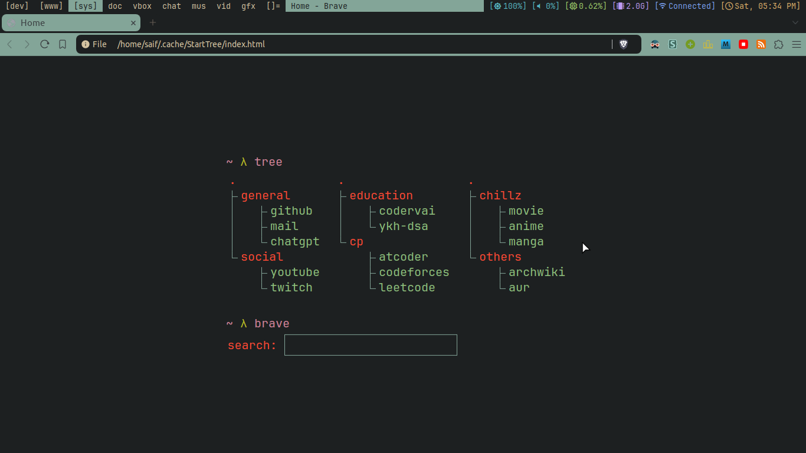

base16-gruvbox-hard
===================

This theme was inspired by `base16-gruvbox-hard` of
[pywal](https://github.com/dylanaraps/pywal).

Installation
------------
- Go to `chrome://extensions`.
- Turn on `Developer mode`.
<div align="center">
    
</div>

- Git clone

```fish
git clone https://github.com/saifshahriar/base16-gruvbox-hard-chromium.git --depth=1
```
- Go to browser and click on `Load unpacked`
<div align="center">
    
</div>

- Locate the root of the directory and click `open` or `select`.
<div align="center">
    
</div>

- Enjoy :)

Screenshots
-----------
<div align="center">
    
    
</div>
